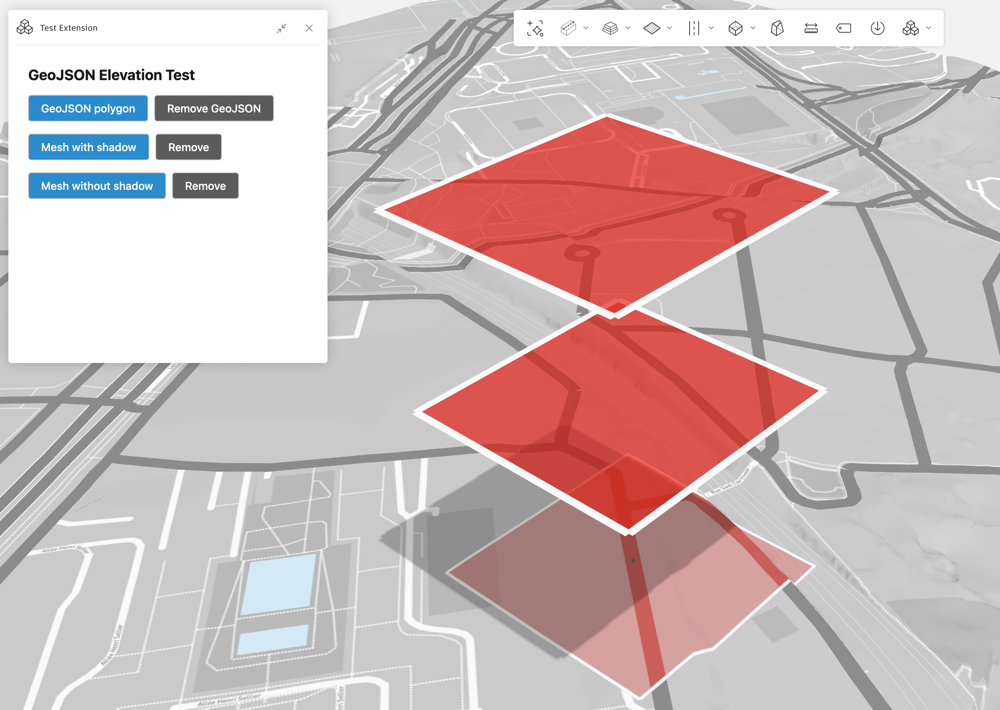

# GeoJSON Elevation Test

An Autodesk Forma extension for testing different approaches to render polygons above terrain.



## Features

- **GeoJSON polygon** - Renders using `Forma.render.geojson.add()` with 2D coordinates (stays on terrain)
- **Mesh without shadow** - Single-sided mesh using `Forma.render.addMesh()` (does not cast shadow)
- **Mesh with shadow** - Double-sided mesh using `Forma.render.addMesh()` (casts shadow)

## Development

```bash
npm install
npm run dev
```

## Build

```bash
npm run build
```
